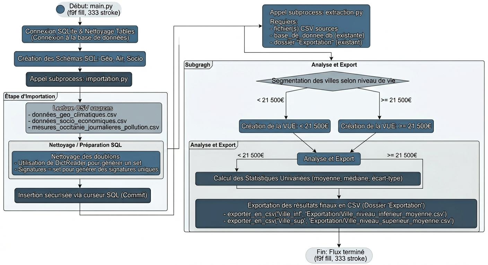

```{css, echo=FALSE}

body, p, td, li {
  font-family: "Times New Roman", Times, serif;
  font-size: 18px;
  line-height: 1.6;
  text-align: justify;
  font-weight: normal;    
  text-decoration: none; 
}


.paragraphe {
  display: block;
  font-size: 18px;
  text-indent: 50px;
  margin-bottom: 15px;
  font-weight: normal;
  text-decoration: none;
}


h1, h2 {
  font-family: "Times New Roman", Times, serif;
  font-weight: bold;
  text-decoration: none;
}

h1 { font-size: 28pt;
  margin-top: 40px; 
  text-align: center;
  }
h2 { font-size: 24pt;
margin-top: 80px;
margin-bottom: 80px;
}
/* Conteneur pour aligner les boutons côte à côte et centrés */
.nav-button-container {
    display: flex;
    justify-content: center;
    gap: 40px;          /* Espace entre les deux boutons */
    margin-top: 50px;
    margin-bottom: 50px;
    width: 100%;
}


pre, code {
  font-family: "Courier New", Courier, monospace !important;
  font-size: 14px !important;
  font-weight: normal;
  
}

```


```{css, echo=FALSE}
padding: 10px 20px;
  background-color: #95a5a6;
  color: white !important;
  border-radius: 20px;
  text-decoration: none !important;
  font-size: 0.9em;
}

.btn-retour:hover {
  background-color: #7f8c8d;
}
```


# Partie informatique:
## Diagramme d'activités


# Requêtes SQL pour répondre au problème statistique
## Justification du choix des Vues SQL
<div class="paragraphe">
L’utilisation de vues plutôt que de tables physiques pour préparer nos analyses statistiques répond à un impératif de flexibilité et de fiabilité. Contrairement à une table, la vue ne duplique pas les données ; elle agit comme une fenêtre dynamique sur les tables sources, garantissant que les exports CSV sont toujours basés sur les données les plus récentes sans risque de désynchronisation. Ce choix permet d'isoler des calculs complexes (moyennes, agrégations) dans une structure virtuelle stable, simplifiant ainsi le passage de la base de données brute à l'outil statistique tout en optimisant l'espace de stockage. En résumé, la vue transforme la donnée technique en information métier exploitable de manière transparente et sécurisée.
</div>
## Structuration des Vues
* **CREATE VIEW  AS**: Correspond à une instruction de définition, elle permet d'enregistrer notre requête sous un nom simple. L'avantage est que à chaque fois qu'ont l'appelle, les données sont recalculées sans occuper d'espace de stockage.
* **SELECT**: Correspont à l'instruction d'extraction des colonnes que l'ont veux sélectionner.
* **JOIN ON **: Correspond à une instruction de liaison, elle permettra de lier nos tables entre elles afin de les exploiter pour l'analyse statistique.
* **WHERE**: Correspond à une instruction de filtrage, qui filtre les données qui respectent une condition précise.
* **GROUP BY**: Correspond à une instruction de regroupement, elle regroupe les lignes d'une table en fonction des valeurs d'une ou plusieurs colonnes.
* **AVG()**: Correspond à une fonction d'agrégation, elle permet le calcule d'une moyenne arithmétique. 

## Affichage d'une requêtes qui pour objectif d'etre extrai en fichier CSV
<div class="paragraphe">
Pour établir une vue pertinente face à notre analyse statistique, cette requêtes extrait les données de nos fichiers CSV, ` QUALITE_AIR` , ` SOCIO_ECONOMIQUES` . Elle se nome ville_niveau_de_vie_superieur_moyenne. Dans un premiers temps il faut selectionner tous les attributs pertinents à notre analyse en utilisant l'instruction d'extraction ` SELECT` . Chaque attribut sera constitué d'un alias avec une lettre majuscule, ça permet de savoir quels  attributs appartiennent à quelle table. L'instruction de liaison ` JOIN`  permet ensuite de fusionner les deux tables en utilisant le code INSEE comme point de contact commun via la clause ON. L'instruction de filtrage ` WHERE`  restreint l'échantillon aux communes dont le niveau de vie médian est supérieur à 21 500 €, tout en ciblant spécifiquement le polluant PM2.5 pour l'année 2022 dans un contexte urbain.
</div>
<div class="paragraphe">
Afin de synthétiser les milliers de relevés quotidiens, nous utilisons la fonction d'agrégation ` AVG` , qui calcule la pollution moyenne par ville. Cette opération nécessite l'emploi de l'instruction de regroupement ` GROUP BY` , qui rassemble toutes les données sous un identifiant unique (le code commune). Enfin, l'ensemble de cette logique est encapsulé dans l'instruction de définition CREATE VIEW, transformant cette requête complexe en une vue. Ce choix permet d'automatiser la mise à jour des données et facilite l'exportation finale vers un format CSV prêt pour l'interprétation statistique.

</div>
```text
curseur.execute(f"""
CREATE VIEW ville_niveau_de_vie_superieur_moyenne AS
SELECT Q.nom_com, Q.code_insee_com, AVG(Q.valeur_poll) AS moyenne_pollution, S.niveau_vie_median_2021
FROM Qualite_Air Q
JOIN Socio_economiques S ON Q.code_insee_com = S.code_insee_com
WHERE S.niveau_vie_median_2021 >= 21500
  AND Q.nom_poll = 'PM2.5' AND Q.annee = 2022
  AND influence = 'Fond' 
  AND typologie = 'Urbaine'
GROUP BY Q.code_insee_com;
""")
```
## Problèmes rencontré lors de la conception

# Partie Statistique 
## Affinage de la problématique
<div class="paragraphe">
Pour répondre à cette problématique, nous avons restreint notre analyse aux stations de typologie `Urbaine` sous influence de `Fond`. Ce choix méthodologique permet de mesurer la pollution moyenne subie par la population, en s’affranchissant des sources d’émission directes comme le trafic routier ou les zones industrielles.
Par ailleurs, nous avons choisi de nous concentrer exclusivement sur les particules fines `PM2.5`. Celles-ci constituent l’indicateur le plus pertinent pour corréler qualité de l’air et niveau de vie, permettant ainsi d’isoler précisément l’impact des facteurs socio-économiques sur l’exposition environnementale. Cette analyse se concentre sur l'année `2022` afin d'assurer la meilleure cohérence temporelle possible avec les indicateurs socio-économiques. En effet, les données les plus récentes concernant le niveau de vie médian datent de 2021 ; or, les variations de ce dernier étant jugées négligeables sur une période d'un an, ce rapprochement offre le cadre d'étude le plus pertinent pour corréler la situation financière des ménages et la qualité de l'air. Pour structurer notre étude, nous avons établi un seuil de segmentation à `21 500 €` de niveau de vie médian. Cette valeur de référence permet de distinguer deux catégories de communes et d'analyser de manière comparative l'impact du contexte socio-économique sur la pollution atmosphérique. Ce seuil a été défini comme le point de bascule statistique pour classer les villes de notre échantillon en deux groupes distincts : les communes aux revenus modestes et celles aux revenus plus élevés.
</div>
## Construire les tables contenant les informations nécessaires au traitement statistique

Pour répondre à la problématique, il faut être capable de sélectionner les taux de concentration PM2.5 correspondant à 

* la modalité **PM2.5** de `nom_poll`,  
* la modalité **Urbaine** de la variable `typologie`,
* la modalité **Fond** de la variable `influence`,
* la modalité **2022** de la variable `annee`,
* Le seuil de **21 500 €** comme valeur pivot pour la variable `niveau_vie_median_2021`.

En intégrant l'ensemble de ces filtres, nous avons généré deux fichiers CSV distincts segmentant les communes d'Occitanie : l'un regroupant les villes dont le niveau de vie médian est inférieur à 21 500 €, et l'autre celles situées au-dessus de ce seuil.

## Description des échantillons de données extraits

Pour mener à bien notre étude comparative, nous avons scindé notre jeu de données en deux échantillons distincts basés sur le seuil pivot du niveau de vie médian national.

Ce premier groupe rassemble les municipalités dont le `niveau de vie médian` est strictement inférieur au seuil de `21 500 €`. Les données, issues de la vue SQL correspondante, ont été exportées afin d'analyser si une fragilité socio-économique est corrélée à une exposition différente aux particules fines `PM2.5`.

```{r, eval = F}
niveau_vie_inferieur <- read.csv(nom_com, code_insee_com, moyenne_pollution, niveau_vie_median_2021)
```

```{r, echo = F}
niveau_vie_inferieur <- read.csv("inf.csv", stringsAsFactors = T)
```


Ce second groupe filtre les communes présentant un `niveau de vie médian supérieur` ou égal à `21 500` €. Cet échantillon sert de groupe de comparaison pour vérifier si une aisance financière supérieure permet l'accès à un environnement urbain moins pollué ou si, au contraire, la concentration de richesses en zone dense augmente l'exposition aux polluants de `fond`.

Cette vue regroupe les communes identifiées par notre script Python dont le revenu fiscal de référence est supérieur au seuil de 21 500 €.
```{r, eval = F}
niveau_vie_superieur <- read.csv(nom_com, code_insee_com, moyenne_pollution, niveau_vie_median_2021)
```

```{r, echo = F}
niveau_vie_superieur  <- read.csv("sup.csv", stringsAsFactors = T)
```


## Résumer des vues permetant l'analyse statistique 

Résumé de la vue contenant les villes ayant un niveau de vie médian inférieur à la moyenne:
```{r}
summary(niveau_vie_inferieur)
```

Résumé de la vue contenant les villes ayant un niveau de vie médian supérieur à la moyenne:
```{r}
summary(niveau_vie_superieur )
``` 
Ces deux fichiers regroupent les données nécessaires pour comparer la situation des communes selon leur profil économique et la qualité de leur air (mesure des particules `PM2.5`).

* **Vue "Niveau de vie inférieur"** : Ce fichier liste les communes où les revenus des habitants sont les plus modestes. On y retrouve plusieurs centres urbains de taille moyenne répartis sur le territoire. L'objectif est d'observer si ces zones sont plus exposées à la pollution atmosphérique.

* **Vue "Niveau de vie supérieur"** : Ce fichier rassemble les communes plus aisées économiquement. Il permet de vérifier si un niveau de vie plus élevé se traduit systématiquement par un environnement plus sain ou si, au contraire, l'activité économique de ces villes s'accompagne d'une pollution importante.

## Choix et justification des indicateurs et outils de visualisation

<div class="paragraphe">
La transformation de données brutes, souvent hétérogènes et volumineuses, 
en informations métier exploitables nécessite une rigueur méthodologique stricte.
Pour ce projet, nous avons sélectionné un ensemble d'indicateurs de position et de
dispersion permettant de capturer la réalité statistique des relevés de PM2.5 en Occitanie.

</div>
## Justification des indicateurs statistiques

* **La Moyenne** : Elle est utilisée comme indicateur central pour stabiliser les milliers de relevés quotidiens de particules `PM2.5`. Elle permet d'obtenir une valeur représentative de l'exposition globale d'une commune sur l'année, facilitant ainsi la comparaison directe entre les différents niveaux de vie.

* **L’Écart-type** : Cet indicateur est essentiel pour mesurer la dispersion des données. Il nous permet de savoir si la pollution d'une ville est constante tout au long de l'année ou si elle subit des pics brutaux. Un écart-type élevé signalera une qualité de l'air instable, indépendamment du niveau de richesse de la commune.

## Justification des choix graphiques
<div class="paragraphe">
Afin de rendre les résultats visuels et compréhensibles, nous avons retenu quatre types de représentations :
</div>
* **Diagrammes en barres (Niveau de vie et Pollution)** : Ce format est idéal pour comparer des catégories distinctes (les deux groupes de villes). Il permet de visualiser instantanément les décrochages entre le groupe "modeste" et le groupe "aisé", tant sur le plan financier que sur le plan des concentrations de polluants.

* **Diagramme en barres de l’écart-type** : Il sert à comparer la "stabilité" de l'air entre les communes. Plus la barre est haute, plus l'air de la ville est soumis à des variations importantes.

* **Nuage de points (Scatter Plot)** : Ce graphique permet de voir d'un seul coup d'œil s'il existe une tendance ou si, au contraire, la richesse et la pollution évoluent de manière totalement indépendante.

* **Diagramme en moustache (Boxplot)** :  Il permet de visualiser la médiane, les quartiles et l’étendue des valeurs de pollution. Il est  utile pour mettre en évidence les disparités internes et identifier si les records de pollution  se concentrent davantage dans une catégorie de villes plutôt qu'une autre.

# Analyse univariée des variables

<div class="paragraphe">
L’analyse univariée constitue la première étape fondamentale de tout processus statistique. Elle consiste à isoler chaque variable du jeu de données pour en examiner les caractéristiques intrinsèques, indépendamment de toute interaction avec d'autres facteurs. Cette approche permet de dresser un profil précis de la distribution, d'identifier la tendance centrale (moyenne, médiane) et de mesurer la dispersion (écart-type, étendue) des relevés de pollution ou des indicateurs socio-économiques.
</div>


```{r setup_natif, include = FALSE}

inf <- read.csv2("inf.csv", stringsAsFactors = FALSE)
sup <- read.csv2("sup.csv", stringsAsFactors = FALSE)

inf$niveau_vie_median_2021 <- as.numeric(as.character(inf$niveau_vie_median_2021))
inf$moyenne_pollution <- as.numeric(as.character(inf$moyenne_pollution))
sup$niveau_vie_median_2021 <- as.numeric(as.character(sup$niveau_vie_median_2021))
sup$moyenne_pollution <- as.numeric(as.character(sup$moyenne_pollution))
```

## Niveau de vie moyen 

```{r}

moy_inf <- mean(inf$niveau_vie_median_2021, na.rm = TRUE)
moy_sup <- mean(sup$niveau_vie_median_2021, na.rm = TRUE)


par(mfrow = c(1, 2), mar = c(5, 6, 4, 4))


barplot(moy_inf, names.arg = "Ville inférieur économiquement", col = "#4E79A7", 
        main = "Niveau de vie moyen", ylab = "Euros (€)",
        ylim = c(0, moy_inf * 1.2))
text(x = 0.7, y = moy_inf, labels = round(moy_inf, 0), pos = 3)

barplot(moy_sup, names.arg = "Ville supérieur économiquement", col = "#F28E2B", 
        main = "Niveau de vie moyen", ylab = "Euros (€)",
        ylim = c(0, moy_sup * 1.2))
text(x = 0.7, y = moy_sup, labels = round(moy_sup, 0), pos = 3)
```
<div class="paragraphe">
Les villes inférieur économiquement ont une distribution de revenus dont la valeur centrale s'établit à `19 221 €`. Cette moyenne arithmétique synthétise un échantillon dont les relevés individuels débutent à `17 810 €`.
</div>
  
<div class="paragraphe">
Les villes supérieur économiquement ont une tendance centrale mis en évidence via un niveau de vie moyen de `22 129 €`. Cette valeur est issue d'une distribution de données dont le maximum atteint est `24 930 €`.
</div>
## Calcul des moyennes de pollution
```{r}
moy_p_inf <- mean(inf$moyenne_pollution, na.rm = TRUE)
moy_p_sup <- mean(sup$moyenne_pollution, na.rm = TRUE)

par(mfrow = c(1, 2), mar = c(5, 6, 4, 4))

barplot(moy_p_inf, names.arg = "Ville inférieur économiquement", col = "#4E79A7", 
        main = "PM2.5 moyen", ylab = "µg/m³",
        ylim = c(0, moy_p_inf * 1.3))
text(x = 0.7, y = moy_p_inf, labels = round(moy_p_inf, 2), pos = 3)

barplot(moy_p_sup, names.arg = "Ville_supérieur économiquement", col = "#F28E2B", 
        main = "PM2.5 moyen", ylab = "µg/m³",
        ylim = c(0, moy_p_sup * 1.3))
text(x = 0.7, y = moy_p_sup, labels = round(moy_p_sup, 2), pos = 3)
```
<div class="paragraphe">
L'analyse montre une pollution plus élevée dans les communes les plus aisées. Les villes ayant un niveau de vie inférieur affichent une concentration moyenne de `8,97 µg/m³`, contre `10,19 µg/m³` pour les villes au niveau de vie supérieur.
</div>
## Calcul des écart-types pour la pollution
```{r}
sd_p_inf <- sd(inf$moyenne_pollution, na.rm = TRUE)
sd_p_sup <- sd(sup$moyenne_pollution, na.rm = TRUE)

par(mfrow = c(1, 2), mar = c(5, 6, 4, 4))

barplot(sd_p_inf, names.arg = "ville inférieur économiquement", col = "#4E79A7", 
        main = "Dispersion", ylab = "Écart (µg/m³)",
        ylim = c(0, max(sd_p_inf, sd_p_sup) * 1.3))
text(x = 0.7, y = sd_p_inf, labels = round(sd_p_inf, 2), pos = 3)

barplot(sd_p_sup, names.arg = "ville supérieur économiquement", col = "#F28E2B", 
        main = "Dispersion", ylab = "Écart (µg/m³)",
        ylim = c(0, max(sd_p_inf, sd_p_sup) * 1.3))
text(x = 0.7, y = sd_p_sup, labels = round(sd_p_sup, 2), pos = 3)
```
<div class="paragraphe">
On observe une forte hétérogénéité au sein du groupe le plus riche. L'écart-type est de `1,03 µg/m³` pour les villes ayant un niveau de vie inférieur, ce qui indique une pollution relativement stable et homogène d'une ville à l'autre. À l'inverse, il grimpe à `2,75 µg/m³` pour les villes au niveau de vie supérieur, révélant des situations très disparates au sein de cette catégorie.
</div>

## Conclusion analyse univariée des communes à revenus modérés
<div class="paragraphe">
Les communes ayant un revenus modérés ont un niveau de vie moyen est de 19 221 €. L'étude de la variable environnementale au sein de cet échantillon permet de dresser les conclusions suivantes :
</div>
* **Tendance centrale** : La concentration moyenne en particules fines `PM2.5` s'établit à `8,97 µg/m³`. Ce résultat indique une exposition chronique significative pour l'ensemble des communes de ce groupe.
* **Indice de dispersion** : L'écart-type est particulièrement faible, s'élevant à `1,03`. En statistique, cette valeur proche de zéro démontre une forte homogénéité des données.

<div class="paragraphe">
On en déduit que la qualité de l'air est uniforme au sein de ces communes à bas revenue. Il n'existe pas de disparités majeures entre ces communes ; elles subissent toutes un niveau de pollution similaire, ce qui rend le profil environnemental de ce segment très prévisible.
</div>
## Conclusion analyse univariée des communes à revenus élevés
<div class="paragraphe">
le niveau de vie moyen pour ces communes s'élève à `22 129 €`, présente une structure statistique sensiblement différente :
</div>
  
* **Tendance centrale** : La moyenne de pollution enregistrée est de `10,19 µg/m³`. Ce chiffre constitue la valeur de référence autour de laquelle s'organisent les relevés de ce groupe.

* **Indice de dispersion** : On observe un écart-type de `2,75`. Cette valeur, nettement plus élevée que dans le groupe précédent, traduit une hétérogénéité des mesures.
<div class="paragraphe">
Cette dispersion importante révèle l'existence de contrastes locaux marqués. Au sein de ce même échantillon, certaines communes bénéficient d'un air plus sain tandis que d'autres font face à des concentrations beaucoup plus fortes. La moyenne est donc ici moins représentative de chaque cas particulier, illustrant une situation environnementale plus instable et diversifiée.
</div>

# Analyse bivariée des variables et conclusion


<div class="paragraphe">
L’analyse bivariée a pour objectif d'explorer la relation statistique entre deux variables : le niveau de vie médian (variable indépendante ou explicative) et la concentration en particules fines PM2.5 (variable dépendante ou expliquée). Contrairement à l'étape précédente, nous ne considérons plus les groupes comme des entités closes, mais nous cherchons à mesurer l'influence du facteur économique sur la qualité de l'air.
</div>
  
<div class="paragraphe">
Cette phase de l'étude s'articule autour de trois axes analytiques majeurs :
</div>
  
* **La direction de la relation** : Nous cherchons à déterminer s'il existe une corrélation positive `les deux variables progressent ensemble`, négative `l'une diminue quand l'autre augmente` ou si elles sont totalement indépendantes.

* **La force du lien** : Grâce à l'étude des écarts entre les moyennes et l'observation des nuages de points, nous évaluons si le niveau de revenu est un prédicteur fiable de l'exposition à la pollution.

* **L'analyse des contrastes de dispersion** : En croisant les écarts-types de chaque groupe, nous vérifions si la richesse d'une commune impacte non seulement le taux de pollution moyen, mais aussi la stabilité de ce taux.

<div class="paragraphe">
En somme, cette approche bivariée permet de tester notre hypothèse de départ : le niveau de vie des administrés conditionne-t-il leur exposition aux particules fines ? C'est par ce croisement que nous pourrons identifier d'éventuelles inégalités environnementales au sein de la région.
</div>
  
## Relation entre Revenu et Pollution (Nuage de points)

```{r bivariée_scatter, fig.width=10, fig.height=6, echo=FALSE}

total_villes <- rbind(inf, sup)


par(mar = c(5, 6, 4, 2))


plot(total_villes$niveau_vie_median_2021, total_villes$moyenne_pollution,
     pch = 19, 
     col = ifelse(total_villes$niveau_vie_median_2021 > 21500, "#F28E2B", "#4E79A7"),
     main = "Corrélation entre Niveau de vie et PM2.5",
     xlab = "Niveau de vie médian (€)", 
     ylab = "Concentration PM2.5 (µg/m³)",
     cex = 1.2)


abline(lm(moyenne_pollution ~ niveau_vie_median_2021, data = total_villes), 
       col = "red", lwd = 2, lty = 2)


legend("topleft", legend = c("Villes Supérieures", "Villes Inférieures", "Tendance"),
       col = c("#F28E2B", "#4E79A7", "red"), pch = c(19, 19, NA), lty = c(NA, NA, 2), bty = "n")
```

<div class="paragraphe">
L’observation du nuage de points révèle une corrélation positive entre le niveau de vie médian et la concentration en particules fines. La droite de régression présente une inclinaison ascendante, indiquant que l'élévation des revenus s'accompagne, dans cet échantillon, d'une dégradation de la qualité de l'air. Si les communes aux revenus modestes forment un cluster homogène en zone de faible pollution, les communes aisées se répartissent sur un spectre beaucoup plus large, confirmant que la richesse économique ne constitue pas un facteur de protection contre l'exposition aux PM2.5.
</div>

## Diagramme moustache 
```{r analyse_boite_moustache, fig.width=8, fig.height=6, echo=FALSE}

par(mar = c(5, 6, 4, 2))


boxplot(inf$moyenne_pollution, sup$moyenne_pollution,
        names = c("Villes Inférieures", "Villes Supérieures"),
        col = c("#4E79A7", "#F28E2B"),
        main = "Répartition de la pollution PM2.5 par niveau de vie",
        ylab = "Concentration PM2.5 (µg/m³)",
        las = 1,         
        notch = FALSE,  
        border = "black") 
```
<div class="paragraphe">
Le diagramme en moustache met en exergue la disparité des situations environnementales selon le profil socio-économique. La médiane du groupe au niveau de vie supérieur est nettement décalée vers le haut par rapport à celle du groupe inférieur, validant une exposition structurellement plus forte. De plus, l'étalement important de la boîte et des moustaches pour les communes aisées démontre une forte hétérogénéité : alors que les villes modestes jouissent d'une qualité de l'air stable, les records de pollution de l'étude se concentrent exclusivement au sein des pôles urbains les plus riches.
</div>

# Conclusion
 
<div class="paragraphe">
En conclusion, l’analyse croisée des données démontre que le niveau de vie exerce un impact paradoxal sur la qualité de l'air en Occitanie. Contrairement à l'hypothèse d'une vulnérabilité environnementale des populations précaires, les résultats révèlent que l'accroissement de la richesse communale est corrélé à une augmentation des concentrations de PM2.5.
</div>

<div class="paragraphe">
Cet impact s'explique par la concentration des revenus élevés dans des zones à forte densité d'activités et de transports, générant une pollution de fond plus intense. Ainsi, dans le cadre de cette étude, un niveau de vie élevé est synonyme d'une exposition environnementale plus subie et plus instable, invalidant l'idée d'un environnement plus sain pour les communes les plus favorisées économiquement.
</div>

# Navigation

<div style="display: flex; justify-content: space-between; margin-top: 50px;">
  
[Retour à l'accueil](../Sommaire.html){style="text-decoration: none; color: #2c3e50; border: 1px solid #2c3e50; padding: 8px 15px; border-radius: 5px;"}
  
[Problématique suivante](./Problematique_2/Problematique_2.html){style="text-decoration: none; color: #2c3e50; border: 1px solid #2c3e50; padding: 8px 15px; border-radius: 5px;"}