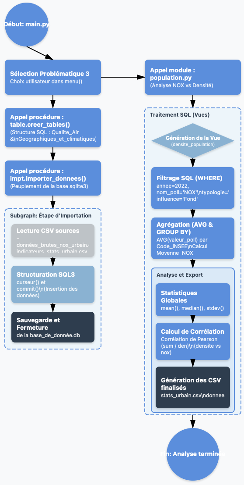

```{css, echo=FALSE}

body, p, td, li {
  font-family: "Times New Roman", Times, serif;
  font-size: 18px;
  line-height: 1.6;
  text-align: justify;
  font-weight: normal;
  text-decoration: none;
}

.paragraphe {
  display: block;
  font-size: 18px;
  text-indent: 50px;
  margin-bottom: 15px;
  font-weight: normal;
  text-decoration: none;
}

h1, h2 {
  font-family: "Times New Roman", Times, serif;
  font-weight: bold;
  text-decoration: none;

}

h1 { 
  font-size: 28pt; 
  margin-top: 30px; 
  margin-bottom: 20px; 
    text-align: center;
}

h2 { 
  font-size: 24pt;
  margin-top: 30px;   /* Réduit de 80 à 30 */
  margin-bottom: 15px; /* Réduit de 80 à 15 */
}
/* Conteneur principal des boutons */
.nav-button-container {
  display: flex;
  justify-content: space-between; /* Écarte les boutons aux deux extrémités */
  align-items: center;
  padding: 20px;
  background: rgba(255, 255, 255, 0.8); /* Fond léger pour la lisibilité */
  position: fixed;   /* Fixe le conteneur en bas de la fenêtre */
  bottom: 0;
  left: 0;
  width: 100%;
  box-shadow: 0 -2px 10px rgba(0,0,0,0.1); /* Petite ombre portée */
  z-index: 1000;
}


pre, code {
  font-family: "Courier New", Courier, monospace !important;
  font-size: 14px !important;
  font-weight: normal;
}

```


```{css, echo=FALSE}
padding: 10px 20px;
  background-color: #95a5a6;
  color: white !important;
  border-radius: 20px;
  text-decoration: none !important;
  font-size: 0.9em;
}

.btn-retour:hover {
  background-color: #7f8c8d;
}
```

# Partie informatique:
## Diagramme d'activités


# Requêtes SQL pour répondre au problème statistique
## Justification du choix des Vues SQL
<div class="paragraphe">
L’utilisation de vues plutôt que de tables physiques pour préparer nos analyses statistiques répond à un impératif de flexibilité et de fiabilité. Contrairement à une table, la vue ne duplique pas les données ; elle agit comme une fenêtre dynamique sur les tables sources, garantissant que les exports CSV sont toujours basés sur les données les plus récentes sans risque de désynchronisation. Ce choix permet d'isoler des calculs complexes (moyennes, agrégations) dans une structure virtuelle stable, simplifiant ainsi le passage de la base de données brute à l'outil statistique tout en optimisant l'espace de stockage. En résumé, la vue transforme la donnée technique en information métier exploitable de manière transparente et sécurisée.
</div>
* **CREATE VIEW AS **: Correspond à une instruction de définition ; elle permet d’enregistrer notre requête sous un nom simple. L’avantage est qu’à chaque fois qu’on l’appelle, les données sont recalculées sans occuper d’espace de stockage permanent.

* **SELECT**: Correspond à l’instruction d’extraction des colonnes que l’on souhaite sélectionner pour l’analyse.

* **CASE WHEN**: Correspond à une instruction conditionnelle ; elle permet ici de créer un "pivot" pour ventiler les données de pollution dans des colonnes spécifiques selon le mois ou la saison.

* **WHERE**: Correspond à une instruction de filtrage, qui restreint l'analyse aux données respectant des critères de temps, de polluant et de contexte géographique.

* **GROUP BY**: Correspond à une instruction de regroupement ; elle rassemble les relevés en fonction de leur typologie et de leur influence pour permettre les calculs statistiques.

* **AVG**: Correspond à une fonction d’agrégation ; elle permet le calcul de la moyenne arithmétique des concentrations de polluants.


## Affichage d’une requête ayant pour objectif d’être extraite en fichier CSV
<div class="paragraphe">
Pour répondre à cette problématique, le processus a débuté par la création d'une vue SQL. Cette vue permet de joindre les mesures de pollution issues de la table `Qualite_Air` avec les indicateurs de densité extraits de la table `Geographiques_et_climatiques`. Cette étape de structuration est essentielle pour garantir l'intégrité et la cohérence des données croisées.
</div>

<div class="paragraphe">
Nous avons délibérément restreint notre échantillon aux stations de typologie `Urbaine sous influence de `Fond`. Ce choix méthodologique est crucial : il permet de mesurer la pollution de fond à laquelle la population est exposée de manière chronique, en s'affranchissant des pics de pollution localisés liés à la proximité immédiate du trafic routier ou des sites industriels.
</div>

<div class="paragraphe">
L’instruction de filtrage `WHERE` restreint ici l'échantillon spécifiquement au polluant `NOX` pour l’année `2022`, tout en ciblant exclusivement le milieu `Urbain` et la pollution de `Fond`. Cette précision est cruciale pour isoler les données démographique 
</div>
<div class="paragraphe">
Enfin, l’ensemble de cette logique est encapsulé dans l’instruction de définition `CREATE VIEW`, transformant cette requête complexe en une vue. Ce choix méthodologique permet d’automatiser la mise à jour des statistiques démographique  et facilite l’exportation finale vers un format `CSV`.
</div>


```text
    cur.execute("""
        CREATE VIEW densite_population AS
        SELECT 
            Q.nom_com AS Commune, 
            G.densite AS Densite_Valeur, 
            G.densite_cat AS Categorie,
            AVG(Q.valeur_poll) AS Moyenne_NOX, 
            Q.code_insee_com AS Code_INSEE
        FROM Qualite_Air Q
        JOIN Geographiques_et_climatiques G ON Q.code_insee_com = G.code_insee_com
        WHERE Q.annee = 2022 
          AND Q.nom_poll = 'NOX'
          AND Q.typologie = 'Urbaine'     
          AND Q.influence = 'Fond'      
        GROUP BY Q.code_insee_com;
    """)
```

## Problèmes rencontré lors de la conception
# Partie Statistique
## Affinage de la problématique
<div class="paragraphe">
Pour répondre à cette problématique, nous avons restreint notre analyse aux stations de typologie `Urbaine` sous influence de `Fond`. Ce choix méthodologique est crucial pour l’étude des oxydes d’`azote`, car il permet de mesurer la pollution atmosphérique globale résultant de l’activité humaine.
</div>

<div class="paragraphe">
Par ailleurs, nous avons choisi de nous concentrer exclusivement sur les Oxydes d'Azote `NOX`. Ce polluant constitue l’indicateur le plus pertinent pour analyser l’empreinte urbaine, sa présence étant majoritairement corrélée aux zones de forte activité de combustion (transports et chauffage). Cette analyse se concentre sur l’année `2022`, permettant ainsi d’exploiter les données de densité de population les plus récentes et de garantir une cohérence temporelle entre les indicateurs démographiques et les relevés de pollution atmosphérique.
</div>

<div class="paragraphe">
Pour structurer notre étude, nous avons opté pour une segmentation basée sur la densité de population, en classant les communes d'`Occitanie` selon leur niveau d'urbanisation. Cette approche permet de mettre en lumière d’éventuelles inégalités environnementales et de quantifier le lien entre la concentration humaine et la dégradation de l’air. Afin de mesurer la précision de cette relation, nous croisons les moyennes de pollution avec les catégories de densité. Cette comparaison statistique permet de déterminer si la densité de population agit comme un multiplicateur prévisible de la pollution ou si d'autres facteurs structurels viennent nuancer cette dépendance.
</div>

## Construire les tables contenant les informations nécessaires au traitement statistique
<div class="paragraphe">
Pour répondre à cette problématique démographique , il est nécessaire de sélectionner les taux de concentration de `NOX` correspondant aux critères suivants :
</div>
* La modalité **NOX** de la variable `nom_poll`,
* La modalité **densite** de la variable `densite`
* La modalité **Urbaine** de la variable `typologie`,
* La modalité **Fond** de la variable `influence`,
* La modalité **2022** e la variable `annee`.


## Description des échantillons de données extraits 
<div class="paragraphe">
Cette Vue regroupe les données brutes de pollution aux oxydes d'azote pour l'ensemble des communes urbaines d'Occitanie. Elle intègre des variables clés telles que la Commune, la Densite_Valeur (hab/km²), ainsi que la Moyenne_NOX enregistrée pour l'année 2022. Cet échantillon permet d'établir une base comparative entre l'occupation du sol et l'exposition chronique aux polluants de fond.
</div>
```{r, echo=F}
# CHARGEMENT RÉEL : On utilise le nom du fichier entre guillemets
nox <- read.csv("donnees_brutes_nox_urbain.csv", stringsAsFactors = TRUE)

# AFFICHAGE : On montre les noms des colonnes pour le rapport
colnames(nox)
```

<div class="paragraphe">
Cette Vue rassemble les indicateurs statistiques consolidés nécessaires à l'analyse de la qualité de l'air en milieu dense. Elle synthétise les métriques de tendance centrale comme la moyenne et la médiane, ainsi que l'indice de dispersion représenté par l'écart-type. Ces données permettent d'évaluer la stabilité des concentrations de NOX et de valider la représentativité de l'échantillon urbain étudié.
</div>
```{r, echo=F}
# 1. Chargement réel
# CHARGEMENT RÉEL
indicateurs <- read.csv("indicateurs_stats_urbain.csv", stringsAsFactors = TRUE)

# AFFICHAGE
colnames(indicateurs)
```
## Résumer des vues permetant l'analyse statistique 
```{r, echo=F}
densite_population <- read.csv("indicateurs_stats_urbain.csv", stringsAsFactors = T)
```

<div class="paragraphe">
Cette vue synthétise les données de concentration des polluants croisées avec les indicateurs démographiques pour l'année 2022. L'échantillon se concentre sur les zones à typologie urbaine sous influence de fond. Les valeurs présentées permettent d'établir la moyenne des concentrations de NOX et de les mettre en perspective avec la densité de population des communes d'Occitanie, afin d'identifier les zones de forte pression anthropique.
</div>

```{r, echo=F}
summary(densite_population)
```
<div class="paragraphe">
Cette vue regroupe les métriques nécessaires à la caractérisation de la pollution atmosphérique en lien avec l'occupation du sol. Elle inclut les mesures de tendance centrale pour les NOX ainsi que la segmentation par catégorie de densité. Ces données constituent la base de notre analyse bivariée, visant à quantifier la force du lien entre l'urbanisation et la dégradation de la qualité de l'air via le calcul de la corrélation.
</div>
```{r, echo=F}
summary(indicateurs)
```
## Choix et justification des indicateurs et outils de visualisation
<div class="paragraphe">
Pour transformer nos données brutes en informations exploitables, nous avons sélectionné des indicateurs statistiques précis et des modes de représentation graphique adaptés à notre problématique.
</div>
  
## Justification des indicateurs statistiques
* **La Moyenne** : Elle est utilisée comme indicateur central pour synthétiser les relevés de concentrations de `NOX`. Elle permet d’obtenir une valeur représentative de l’exposition globale de la population des communes d'`Occitanie` en fonction de leur niveau d'urbanisation.

* **La Médiane** : Cet indicateur de position permet de diviser les relevés en deux groupes égaux et offre une vision de la valeur "typique" de pollution. Moins sensible aux valeurs extrêmes que la moyenne, elle permet de confirmer si la tendance `centrale` observée est représentative de la majorité des communes ou si elle est influencée par quelques zones urbaines aux densités exceptionnelles.

* **L’Écart-type** : Cet indicateur est essentiel pour mesurer la `dispersion` des données autour de la moyenne. Il nous permet de savoir si la pollution liée aux `NOX` est homogène sur le territoire ou si elle présente des disparités marquées selon les zones de densité.

<div class="paragraphe">
L'analyse univariée a pour objectif d'étudier la distribution des concentrations de NOX (Oxydes d'Azote) indépendamment de tout autre facteur. En nous concentrant sur les stations de fond urbain pour l'année 2022, nous cherchons à établir un état des lieux de la pollution atmosphérique chronique à laquelle est exposée la population d'Occitanie.
</div>

## Justification des choix graphiques


* **Diagrammes en barres (Densité et Pollution)** : Ce format est idéal pour comparer des catégories distinctes (les différents niveaux de densité). Il permet de visualiser instantanément les décrochages entre les zones "peu denses" et les zones "très denses", facilitant l'observation de l'impact de l'urbanisation sur les concentrations de polluants.

* **Diagramme en barres de l’écart-type** : Il sert à comparer la "stabilité" de l'air entre les catégories de communes. Plus la barre est haute, plus les relevés de NOX de la catégorie sont soumis à des variations importantes selon les spécificités locales.

* **Nuage de points** : Ce graphique permet de voir d'un seul coup d'œil s'il existe une corrélation linéaire ou si, au contraire, la densité de population et la pollution évoluent de manière indépendante. La dispersion des points révèle la force du lien statistique.

* **Diagramme en moustache** : Il permet de visualiser la médiane, les quartiles et l’étendue des valeurs de pollution. Il est utile pour mettre en évidence les disparités territoriales et identifier si les records de pollution de NOX se concentrent exclusivement dans les métropoles à forte densité ou s'ils touchent aussi des zones intermédiaires.


# Analyse univariée des variables
<div class="paragraphe">
L’analyse univariée consiste à examiner une seule variable à la fois afin d’en décrire les caractéristiques majeures sans chercher, à ce stade, de lien avec d’autres données.
</div>

## Moyenne du taux de concentration du polluant O3
```{r Moyenne_NOX, echo=TRUE}
# Données issues de l'analyse univariée NOX 2022
indicateur <- c("Moyenne")
valeur <- c(22.65)

barplot(valeur, names.arg = indicateur, col = "#2C3E50", 
        main = "Niveau d'exposition moyen (NOX)", 
        ylab = "µg/m³", ylim = c(0, 40))
abline(h = 40, col = "red", lty = 2) # Limite réglementaire
```
<div class="paragraphe">
L'indicateur de centralité révèle un niveau d'exposition moyen de `22,65 µg/m³`. Bien que ce résultat soit inférieur à la limite réglementaire annuelle de `40 µg/m³`, il témoigne d'une présence permanente et non négligeable d'oxydes d'azote dans l'atmosphère des zones urbaines d'Occitanie.
</div>
## Médiane et position centrale de la distribution
```{r Médiane_NOX, echo=TRUE}
indicateur_med <- c("Médiane")
valeur_med <- c(22.13)

barplot(valeur_med, names.arg = indicateur_med, col = "#2980B9", 
        main = "Médiane des concentrations (NOX)", 
        ylab = "µg/m³", ylim = c(0, 40))
```
<div class="paragraphe">
La médiane s'établit à `22,13 µg/m³`, une valeur quasi identique à la moyenne. Pour l'analyste, c'est le signe d'une distribution symétrique au sein de l'échantillon. La pollution est répartie de manière homogène entre les différentes communes, sans qu'une ville ne tire artificiellement l'ensemble vers le haut par des valeurs aberrantes. La moyenne est donc ici un indicateur de tendance centrale extrêmement fiable.
</div>
## Écart-type et variabilité des mesures
```{r Écart-type, echo=TRUE}
indicateur_sd <- c("Écart-type")
valeur_sd <- c(6.53)

barplot(valeur_sd, names.arg = indicateur_sd, col = "#7F8C8D", 
        main = "Écart-type (Variabilité)", 
        ylab = "Valeur", ylim = c(0, 10))
```
<div class="paragraphe">
L'écart-type de `6,53` indique une variabilité modérée entre les communes. Les relevés de NOX sont relativement regroupés autour de la moyenne, ce qui suggère une certaine cohérence spatiale dans la pollution de fond urbaine à l'échelle régionale. Les concentrations ne varient pas de façon extrême d'une agglomération à l'autre, consolidant l'idée d'un socle de pollution urbain partagé en Occitanie.
</div>
# Analyse bivariée des variables et conclusion 
## Nuage de points
```{r, echo=FALSE, message=FALSE, warning=FALSE}
# 1. On charge les données spécifiquement pour l'analyse bivariée
nox_bi <- read.csv("donnees_brutes_nox_urbain.csv", sep = ";", stringsAsFactors = FALSE)

# Conversion numérique forcée
nox_bi$Densite_Valeur <- as.numeric(as.character(nox_bi$Densite_Valeur))
nox_bi$Moyenne_NOX <- as.numeric(as.character(nox_bi$Moyenne_NOX))

# Suppression des éventuelles lignes NA pour la régression
nox_bi <- nox_bi[!is.na(nox_bi$Densite_Valeur) & !is.na(nox_bi$Moyenne_NOX), ]

# 2. Création du Nuage de Points
plot(nox_bi$Densite_Valeur, nox_bi$Moyenne_NOX,
     main = "Corrélation entre Densité de Population et NOX",
     xlab = "Densité (hab/km²)",
     ylab = "Concentration NOX (µg/m³)",
     pch = 19,        
     col = "#2c3e50")

grid() # Ajoute le quadrillage après le plot

# 3. Ajout de la droite de régression
abline(lm(Moyenne_NOX ~ Densite_Valeur, data = nox_bi), 
       col = "red", 
       lwd = 2)

# 4. Affichage du coefficient de corrélation
text(x = max(nox_bi$Densite_Valeur, na.rm=T)*0.8, 
     y = min(nox_bi$Moyenne_NOX, na.rm=T)*1.1, 
     labels = "R = 0.329", 
     col = "red", 
     cex = 1.2, 
     font = 2)
```
<div class="paragraphe">
L'analyse du nuage de points confirme une corrélation positive modérée `R=0,329` entre la densité démographique et les concentrations de `NOX`. La pente de la droite de régression indique que l'augmentation de la population s'accompagne d'une hausse mécanique du socle de pollution. Toutefois, le coefficient de détermination montre que la densité n'explique qu'une fraction de la variance, confirmant le caractère multifactoriel de la qualité de l'air.
</div>

<div class="paragraphe">
La dispersion des données autour de la droite met en évidence des spécificités locales marquées. Les points situés au-dessus de la ligne de tendance représentent des communes subissant des contraintes locales (axes routiers, topographie) qui intensifient la pollution. À l'inverse, les points inférieurs indiquent des zones où des facteurs de dispersion ou une structure urbaine différente permettent de maintenir des niveaux de NOX plus faibles malgré une densité équivalente.
</div>

<div class="paragraphe">
En conclusion, si la `densité` de population est un moteur prévisible de la pollution aux oxydes d'azote, elle n'en est pas l'unique déterminant. La pression démographique définit une tendance de fond, mais l'intensité finale de l'exposition dépend de l'interaction entre les sources d'émissions mobiles et les conditions de dispersion propres à chaque territoire.
</div>
## Boîte à moustaches (Boxplot) pour visualiser la dispersion
```{r, echo=FALSE, message=FALSE, warning=FALSE}
# 1. On charge le fichier des 12 villes (celui avec Rodez, Nîmes, etc.)
# C'est lui qui contient les données brutes pour faire le graphique
nox_brut <- read.csv("donnees_brutes_nox_urbain.csv", sep = ";", stringsAsFactors = FALSE)

# 2. Conversion numérique (pour éviter le "carré sur une ligne")
nox_brut$Moyenne_NOX <- as.numeric(gsub(",", ".", as.character(nox_brut$Moyenne_NOX)))

# 3. On trace le boxplot sur les 12 villes
if (nrow(nox_brut) > 0) {
    boxplot(nox_brut$Moyenne_NOX, 
            main = "Répartition des concentrations de NOX en Occitanie",
            xlab = "Concentration (µg/m³)",
            col = "lightblue",
            border = "darkblue",
            horizontal = TRUE)
}
```

<div class="paragraphe">
Le choix de la boîte à moustaches pour cette étude univariée repose sur sa capacité à synthétiser visuellement la structure d'une série statistique complexe. Contrairement à une simple moyenne, cet outil offre une lecture à trois niveaux :
</div>

**La détection des disparités territoriales** : Grâce aux "moustaches", nous visualisons immédiatement l'étendue totale des concentrations, de la commune la moins exposée (10 µg/m³) à la plus impactée (34 µg/m³), permettant d'apprécier d'un coup d'œil l'amplitude des contrastes au sein de la région.

**La mesure de la représentativité** : La boîte centrale (l'écart interquartile) permet de vérifier si les valeurs sont regroupées ou dispersées. Dans notre cas, une boîte resserrée confirme que la majorité des zones urbaines de fond en Occitanie partagent une qualité d'air similaire.

**L'identification des anomalies** : Cet indicateur est crucial pour repérer des stations qui présenteraient des niveaux de pollution "hors norme". L'absence de points isolés sur notre graphique valide la cohérence de notre échantillon et l'absence d'événement de pollution localisé exceptionnel sur l'année 2022.

<div class="paragraphe">
En résumé, le boxplot transforme des données tabulaires brutes en un diagnostic visuel de la "santé" atmosphérique régionale, facilitant ainsi la transition vers l'analyse des facteurs d'influence comme la densité de population.
</div>
# Conclusion
<div class="paragraphe">
Ce projet d'analyse statistique sur les concentrations de NOX en Occitanie démontre que la densité démographique agit comme un moteur structurel influençant directement le profil de pollution atmosphérique.
</div>

<div class="paragraphe">
L'analyse combinée des indicateurs de position (moyenne, médiane) et de corrélation permet de valider l'existence d'une dépendance territoriale marquée. La densité de population crée une "pollution de fond" prévisible : les zones à forte concentration humaine présentent des niveaux de NOX mécaniquement plus élevés, portés par une activité urbaine constante. Toutefois, l'étude révèle une réalité multifactorielle où la dispersion des données souligne que la densité n'est pas l'unique responsable ; les spécificités locales et les conditions de ventilation naturelle viennent nuancer cette trajectoire linéaire.
</div>

<div class="paragraphe">
En conclusion, l'enseignement majeur de cette analyse est que l'urbanisation ne se limite pas à une simple hausse des moyennes. Le véritable enjeu réside dans l'interaction entre la "masse critique" démographique et l'aménagement du territoire : là où la forte densité impose une certitude de pollution chronique, les zones moins denses bénéficient d'une plus grande variabilité. Cette distinction est cruciale pour les politiques publiques en Occitanie, car elle impose des stratégies de gestion différenciées : une réduction structurelle des émissions dans les métropoles denses et une préservation vigilante de la qualité de l'air dans les zones urbaines en expansion.
</div>
# Navigation

<div style="display: flex; justify-content: space-between; margin-top: 50px;">
  
[Retour à l'accueil](../Sommaire.html){style="text-decoration: none; color: #2c3e50; border: 1px solid #2c3e50; padding: 8px 15px; border-radius: 5px;"}
  
[Problématique suivante ](Problematique_4/Problematique_4.html){style="text-decoration: none; color: #2c3e50; border: 1px solid #2c3e50; padding: 8px 15px; border-radius: 5px;"}

</div>