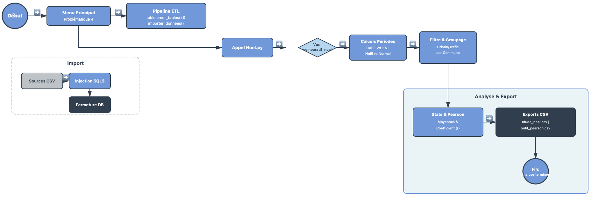

```{css, echo=FALSE}
/* Force la police sans gras ni soulignement pour le texte courant */
body, p, td, li {
  font-family: "Times New Roman", Times, serif;
  font-size: 18px;
  line-height: 1.6;
  text-align: justify;
  font-weight: normal;    
  text-decoration: none; 
}


.paragraphe {
  display: block;
  font-size: 18px;
  text-indent: 50px;
  margin-bottom: 15px;
  font-weight: normal;
  text-decoration: none;
}


h1, h2, h3, h4 {
  font-family: "Times New Roman", Times, serif;
  font-weight: bold;
  text-decoration: none;
}

h1 { font-size: 28pt; 
margin-top: 40px; 
text-align: center;
}
h2 { font-size: 24pt;
margin-top: 80px;
margin-bottom: 80px;
}

pre, code {
  font-family: "Courier New", Courier, monospace !important;
  font-size: 14px !important;
  font-weight: normal;
  
}

```


```{css, echo=FALSE}
padding: 10px 20px;
  background-color: #95a5a6;
  color: white !important;
  border-radius: 20px;
  text-decoration: none !important;
  font-size: 0.9em;
}

.btn-retour:hover {
  background-color: #7f8c8d;
}
```

# Partie informatique:
## Diagramme d'activités


# Requêtes SQL pour répondre au problème statistique
## Justification du choix des Vues SQL
<div class="paragraphe">
L’utilisation de vues plutôt que de tables physiques pour préparer nos analyses statistiques répond à un impératif de flexibilité et de fiabilité. Contrairement à une table, la vue ne duplique pas les données ; elle agit comme une fenêtre dynamique sur les tables sources, garantissant que les exports CSV sont toujours basés sur les données les plus récentes sans risque de désynchronisation. Ce choix permet d'isoler des calculs complexes (moyennes, agrégations) dans une structure virtuelle stable, simplifiant ainsi le passage de la base de données brute à l'outil statistique tout en optimisant l'espace de stockage. En résumé, la vue transforme la donnée technique en information métier exploitable de manière transparente et sécurisée.
</div>
* **CREATE VIEW AS **: Correspond à une instruction de définition ; elle permet d’enregistrer notre requête sous un nom simple. L’avantage est qu’à chaque fois qu’on l’appelle, les données sont recalculées sans occuper d’espace de stockage permanent.

* **SELECT**: Correspond à l’instruction d’extraction des colonnes que l’on souhaite sélectionner pour l’analyse.

* **CASE WHEN**: Correspond à une instruction conditionnelle ; elle permet ici de créer un "pivot" pour ventiler les données de pollution dans des colonnes spécifiques selon le mois ou la saison.

* **WHERE**: Correspond à une instruction de filtrage, qui restreint l'analyse aux données respectant des critères de temps, de polluant et de contexte géographique.

* **GROUP BY**: Correspond à une instruction de regroupement ; elle rassemble les relevés en fonction de leur typologie et de leur influence pour permettre les calculs statistiques.

* **AVG**: Correspond à une fonction d’agrégation ; elle permet le calcul de la moyenne arithmétique des concentrations de polluants.

## Affichage d’une requête ayant pour objectif d’être extraite en fichier CSV
<div class="paragraphe">
Pour analyser l'effet des fêtes sur la pollution, nous avons créé une vue SQL nommée `comparatif_noel` à partir de la table `QUALITE_AIR`. L'objectif est de mettre en opposition les niveaux de pollution entre la routine de décembre et la période spécifique des vacances de fin d'année.
</div>
<div class="paragraphe">
Dans notre requête, nous utilisons un filtre `WHERE` pour nous concentrer uniquement sur le `NOX`. Nous avons choisi de cibler exclusivement les stations `Urbaines` sous influence `Trafic`. 
</div>
<div class="paragraphe">
Pour obtenir des chiffres comparables, nous utilisons la fonction `AVG` avec des conditions `CASE WHEN`. Cela nous permet de calculer en une seule fois la moyenne de pollution pour la période `normale` et celle pour la période de `Noel`. Nous utilisons ensuite un `GROUP BY` pour organiser ces résultats par ville.
</div>
<div class="paragraphe">
Enfin, nous avons enregistré cette logique avec l'instruction `CREATE VIEW`. Cela transforme notre requête en une table virtuelle, ce qui est beaucoup plus simple pour automatiser nos calculs et exporter les résultats en `CSV`.
</div>
```text
    cur.execute("""
        CREATE VIEW comparatif_noel AS
        SELECT 
            nom_com AS Commune,
            AVG(CASE WHEN (annee = 2022 AND mois = 12 AND jour >= 20) 
                       OR (annee = 2023 AND mois = 1 AND jour <= 5) 
                THEN valeur_poll END) AS Moyenne_Noel,
            AVG(CASE WHEN (annee = 2022 AND mois = 12 AND jour BETWEEN 5 AND 19) 
                THEN valeur_poll END) AS Moyenne_Normal
        FROM Qualite_Air
        WHERE nom_poll = 'NOX' AND typologie = 'Urbaine' AND influence = 'Trafic'
        GROUP BY nom_com
        HAVING Moyenne_Noel IS NOT NULL AND Moyenne_Normal IS NOT NULL;
    """)
```


## Problèmes rencontré lors de la conception
# Partie Statistique
## Affinage de la problématique
<div class="paragraphe">
Afin d'isoler l'impact des comportements saisonniers sur l'environnement, notre démarche s'est structurée autour d'une vue SQL spécifique. Cet outil nous a permis de segmenter temporellement les mesures de la table `Qualite_Air` pour mettre en opposition deux phases distinctes, la periode de fêtes de fin d'année et les deux premiérs semaine qui la précèdes.
</div>

<div class="paragraphe">
Cette segmentation rigoureuse garantit que les variations observées et le calcul ultérieur du `coefficient de Pearson` reflètent de véritables changements d'habitudes citadines, plutôt que des fluctuations climatiques globales ou des émissions industrielles constantes.
</div>
## Construire les tables contenant les informations nécessaires au traitement statistique
<div class="paragraphe">
Pour répondre à cette problématique démographique , il est nécessaire de sélectionner les taux de concentration de `NOX` correspondant aux critères suivants :
</div>
* La modalité **NOX** de la variable `nom_poll`,
* La modalité **Urbaine** de la variable `typologie`,
* La modalité **Trafic** de la variable `influence`,
* La modalité **2022** e la variable `annee`.
* La modalité **2023** e la variable `annee`.

## Description des échantillons de données extraits 
<div class="paragraphe">
Cette Vue regroupe les données brutes de `NOX` dans une typologie `Urbaine`  incluant des variables comme la d’`influence`, l’année d’observation `2022`, ainsi que la `moyenne` ,l’`écart-type` des concentrations en polluants. Elle permet d’analyser les variations saisonnières de la qualité de l’air et d’identifier les tendances ou anomalies spécifiques à la période estivale.
</div>

```{r, eval = F}
noel <- read.csv(Ville,Pollution_Normal,Pollution_Noel,Ecart_Normal,Ecart_Noel)
```
```{r, echo= F}
noel <- read.csv("outil_statistique_pearson.csv", stringsAsFactors=T,)
```
```{r}
summary(noel)
```

## Résumer des vues permetant l'analyse statistique 
<div class="paragraphe">
Le fichier `outil_statistique_pearson.csv` regroupe les métriques nécessaires à la réalisation de notre double étude. D'une part, une analyse univariée qui caractérise les concentrations de `NOX` durant les fêtes via le calcul de la `moyenne` globale. D'autre part, une analyse bivariée visant à quantifier la relation entre la pollution de la période "normale" et celle de la période de "Noël" grâce au coefficient de `corrélation de Pearson`.
</div>
```{r}
summary(noel)
```
<div class="paragraphe">
L'analyse univariée a pour objectif d'étudier la distribution des taux de NOX (Oxydes d'Azote) spécifiquement pendant la trêve des confiseurs. En nous concentrant sur les stations de trafic urbain pour la période charnière entre 2022 et 2023, nous cherchons à établir si les comportements liés aux vacances et aux festivités modifient l'empreinte polluante habituelle des villes d'Occitanie.
</div>


## Choix et justification des indicateurs et outils de visualisation
<div class="paragraphe">
Pour transformer nos données brutes en informations exploitables, nous avons sélectionné des indicateurs statistiques précis et des modes de représentation graphique adaptés à notre problématique.
</div>
## Justification des indicateurs statistiques
* **La Moyenne :** La moyenne nous sert à résumer la situation globale de chaque période (normale vs Noël) en un seul chiffre. Elle est indispensable pour répondre à notre question de base : "Est-ce qu'on pollue plus ou moins pendant les vacances ?". En comparant la moyenne de la période normale avec celle de la période des fêtes, nous pouvons voir immédiatement s'il y a une hausse ou une baisse générale des émissions de `NOX` à l'échelle de la région.


* **La corrélation de Pearson (r) :** Le coefficient de Pearson nous permet d'aller plus loin que la simple moyenne. Son rôle est de mesurer la force du lien entre les deux périodes.
Si `r` est proche de 1, cela signifie que les habitudes de pollution restent les mêmes, les villes les plus polluées en temps normal le restent exactement de la même façon pendant Noël.
Si `r` diminue, cela montre que les vacances ont totalement bouleversé la hiérarchie habituelle.

<div class="paragraphe">
En résumé, la moyenne nous donne l'évolution de la quantité de pollution, tandis que la corrélation nous indique si la structure de cette pollution a changé à cause du comportement des habitants pendant les festivités.
</div>

## Justification des choix graphiques
* **Le Diagramme en bâtons groupés (Bar Chart) :**Il permet de mettre côte à côte, pour chaque commune, la barre `Période Normale` et la barre `Période Noël`. 


* **Nuage de points** : Ce graphique permet de voir d'un seul coup d'œil s'il existe une corrélation linéaire ou si, au contraire, la densité de population et la pollution évoluent de manière indépendante. La dispersion des points révèle la force du lien statistique.

* **Diagramme en moustache** : Il permet de visualiser la médiane, les quartiles et l’étendue des valeurs de pollution. Il est utile pour mettre en évidence les disparités territoriales et identifier si les records de pollution de NOX se concentrent exclusivement dans les métropoles à forte densité ou s'ils touchent aussi des zones intermédiaires.


# Analyse univariée des variables
<div class="paragraphe">
Pour cette première étape, nous étudions uniquement la colonne Moyenne_Noel de nos données. L'idée est de voir comment se répartit la pollution entre toutes les communes d'Occitanie durant les vacances.
</div>

```{r boxplot_noel, fig.cap="Distribution de la pollution au NOX pendant la période de Noël", echo=TRUE}

data <- read.csv("outil_statistique_pearson.csv")


data_clean <- data[data$Ville != "" & data$Ville != "Coefficient de Corrélation r", ]


data_clean$Pollution_Noel <- as.numeric(as.character(data_clean$Pollution_Noel))


boxplot(data_clean$Pollution_Noel,
        main = "Analyse Univariée : NOX à Noël",
        ylab = "Concentration (µg/m³)",
        col = "skyblue",
        border = "darkblue",
        notch = FALSE)


points(mean(data_clean$Pollution_Noel, na.rm = TRUE), col = "red", pch = 18, cex = 1.5)
```


<div class="paragraphe">
L’analyse de la boîte interquartile permet d'identifier la structure de la pollution pour `50 %` des communes centrales de l’échantillon. Une boîte compacte indique une homogénéité des niveaux de `NOX` sur le territoire pendant les fêtes, tandis qu'un étalement important révèle des situations locales très disparates selon les zones urbaines.
</div>


<div class="paragraphe">
L’examen des moustaches  met en évidence l'hétérogénéité du milieu urbain sous influence « Trafic ». La présence de points isolés en haut de l'échelle identifie les communes subissant des pics de pollution exceptionnels durant cette période spécifique, contrastant avec la tendance régionale.
</div>


<div class="paragraphe">
La position verticale de la boîte sur l'échelle des μg/m 
3 sert d'indicateur de santé atmosphérique saisonnière. Une boîte située en bas de l'échelle suggère que, malgré l'activité liée aux fêtes, la qualité de l'air reste respirable pour la majorité des communes d'Occitanie.
</div>

<div class="paragraphe">
En conclusion cette étude univariée dresse l’état des lieux de la pollution atmosphérique à Noël. Elle permet de valider la cohérence de l'échantillon et de quantifier la variabilité des mesures avant toute comparaison avec les périodes normales. Ce diagnostic confirme que la nature de la donnée à Noël est stable, bien que ponctuée de disparités territoriales marquées par l'influence du trafic.
</div>


# Analyse bivariée des variables et conclusion 
## Nuage de points


```{r scatter_noel, fig.cap="Corrélation des niveaux de NOX entre la période normale et Noël", echo=TRUE}

data_clean$Pollution_Normal <- as.numeric(as.character(data_clean$Pollution_Normal))
data_clean$Pollution_Noel <- as.numeric(as.character(data_clean$Pollution_Noel))


plot(data_clean$Pollution_Normal, data_clean$Pollution_Noel,
     main = "Analyse Bivariée : Normal vs Noel",
     xlab = "Pollution Normale (µg/m³)",
     ylab = "Pollution Noël (µg/m³)",
     pch = 19, col = "darkblue")


abline(lm(Pollution_Noel ~ Pollution_Normal, data = data_clean), col = "red", lwd = 2)


grid()
```

* **La validation de la structure habituelle** : Le calcul du coefficient de Pearson r permet de mesurer la stabilité. Un coefficient proche de 1 démontre que la pollution reste structurelle, les pôles urbains à fort trafic habituel demeurent les points noirs de la région. Cela confirme que l'activité liée à Noël se calque sur le réseau routier existant sans déplacer les foyers de pollution majeurs.

* **La détection des mutations de mobilité** : L'observation des points s'écartant de la droite de régression peermet d'identifier les ruptures de comportement.

* **La synthèse de l'influence saisonnière** : Cette corrélation permet de définir si la période de fin d'année agit comme un simple prolongement de la pollution chronique ou comme un événement perturbateur. 

# Conclusion 
<div class="paragraphe">
Ce projet démontre que si la densité démographique définit le socle de pollution, les fêtes de fin d'année agissent comme le principal levier de variation saisonnière en Occitanie.
</div>

<div class="paragraphe">
L'étude prouve que l'impact des fêtes est asymétrique : il ne touche pas toutes les communes avec la même intensité. La hiérarchie urbaine reste le cadre dominant, mais la saisonnalité introduit une volatilité qui peut fragiliser les zones les plus exposées au flux de visiteurs. 
</div>

<div class="paragraphe">
En conclusion la gestion de la qualité de l'air ne peut être uniforme toute l'année. L'impact des fêtes impose une réduction de fond des émissions urbaines couplée à une régulation spécifique des flux de transport lors des périodes de forte activité saisonnière.
</div>
# Navigation

<div style="display: flex; justify-content: space-between; margin-top: 50px;">
  
[Retour à l'accueil](../Sommaire.html){style="text-decoration: none; color: #2c3e50; border: 1px solid #2c3e50; padding: 8px 15px; border-radius: 5px;"}
  
[Problématique 1 ](../Problematique_1/Problematique_1.html){style="text-decoration: none; color: #2c3e50; border: 1px solid #2c3e50; padding: 8px 15px; border-radius: 5px;"}

</div>